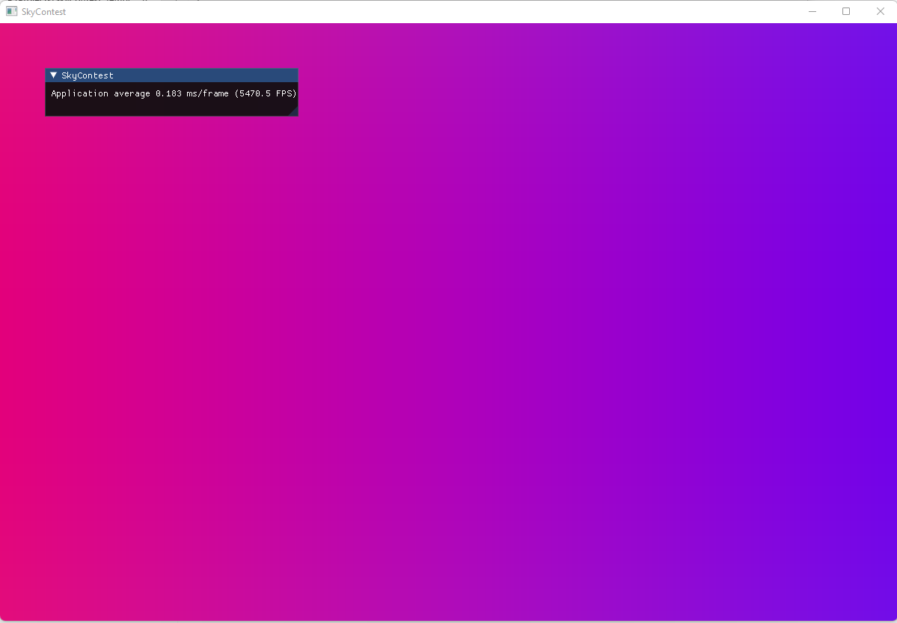

# SkyContest_Template_OpenGL

Here is a starting point you can use to begin Sky Contest. This application automatically recompiles shaders every time you save a shader file. Also you can use ImGui to add some control widgets.



## How to compile

With MSBuild (Windows):

```
mkdir build
cd build
cmake ..
cmake --build . --config Release --target ALL_BUILD
```

Other build systems:

```
mkdir build
cd build
cmake -DCMAKE_BUILD_TYPE=Debug ..
cmake --build .
```

## How to run:

Just run `sky_contest` binary from `out/sbin` directory.
